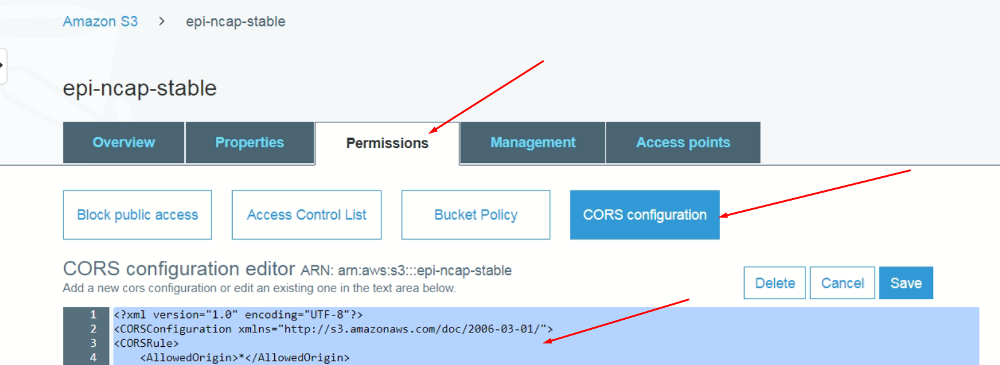

NCAP
=======

Instruction
------------

   NCAP (Neuroscience Cloud Analysis Platform) Web Interface  
   (Minimum Viable Product)
    
Reference documentation
-------------
 <a href="./NCAP Minimum Viable Product.pdf" target="_blank">NCAP Minimum Viable Product.pdf</a>
 
Technologies
------------
 Project is created with
- Python version: 3
- Django version: 2.2.3

Installation
------------
For this project, first install the necessary packages using pip:

        $ virtualenv venv
        $ source  venv/bin/activate
        (venv) $ pip install -r requirements.txt 

How to run
----------
Run this script using python:

        (venv) $ python manage.py runserver

CORS permission for ayanlysis bucket
------------------------------------

- you need to add these permissions in bucket permission tag

    
    
        <?xml version="1.0" encoding="UTF-8"?>
        <CORSConfiguration xmlns="http://s3.amazonaws.com/doc/2006-03-01/">
        <CORSRule>
            <AllowedOrigin>*</AllowedOrigin>
            <AllowedMethod>GET</AllowedMethod>
            <AllowedMethod>PUT</AllowedMethod>
            <AllowedMethod>POST</AllowedMethod>
            <AllowedMethod>DELETE</AllowedMethod>
            <MaxAgeSeconds>3000</MaxAgeSeconds>
            <ExposeHeader>ETag</ExposeHeader>
            <AllowedHeader>*</AllowedHeader>
        </CORSRule>
        </CORSConfiguration>

